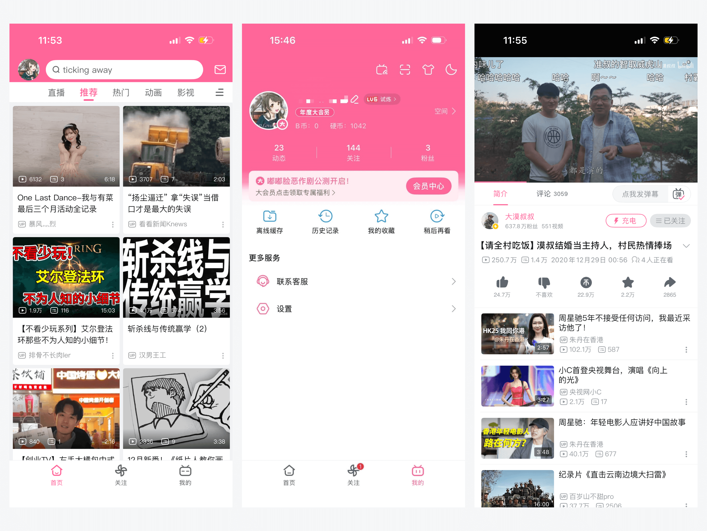
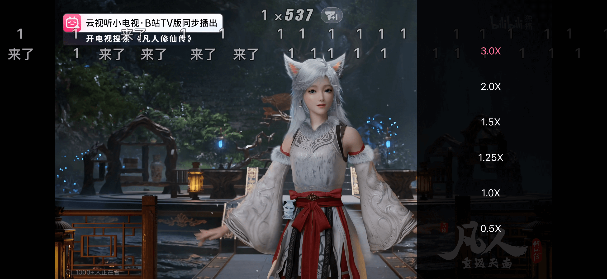
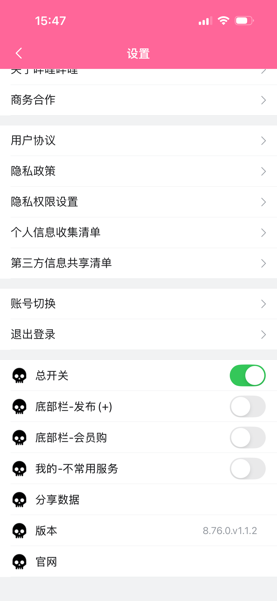

# BiliBiliTweak


[](https://github.com/TouchFriend/BiliBiliTweak/releases)


一个基于 **iOS 逆向分析** 的 **哔哩哔哩无广告越狱插件**，用于移除客户端广告并优化播放体验。

> ⚠️ 插件仅适用于 **越狱设备**，不支持巨魔注入

---

## 👀 效果展示





## 📌 项目说明

- 适用于 **已越狱的 iOS / iPadOS 设备**
- 基于 **Theos / MonkeyDev** 进行开发
- 仅修改客户端本地行为，不涉及任何服务器或接口逻辑

如果你使用的是 **非越狱设备**，请参考以下项目：

👉 [无广告版哔哩哔哩（非越狱版）](https://github.com/TouchFriend/BiliBiliMApp)

---

## ✨ 功能特性

- 🚫 去除启动页、信息流、详情页等广告
- 👁️ 可选隐藏底部加号、会员购及「我的」中的不常用服务
- ⏩ 新增 **3 倍速播放功能**（仅限 `8.41.0`、`8.76.0` 版本）

---

## 🚀 快速安装（推荐）

在 **越狱设备** 上打开 `Cydia` 应用：

1. 进入 `软件源` → `编辑` → `添加`
2. 添加以下软件源地址：

```text
https://touchfriend.github.io
```

1. 确认源列表中出现 **TouchFriend's Repo**
2. 打开 `TouchFriend's Repo` → 插件
3. 安装 **BiliBiliTweak**
4. 重启 App（或 Respring）

------

## 🛠️ 从源码构建（开发者）

### 1️⃣ 环境准备

- 安装 [MonkeyDev](https://github.com/AloneMonkey/MonkeyDev)
- 确保设备已越狱并可正常调试

------

### 2️⃣ 获取源码

```bash
git clone https://github.com/TouchFriend/BiliBiliTweak.git
```

------

### 3️⃣ 编译并运行

1. 使用 Xcode 打开工程
2. 选择越狱真机设备
3. 编译并运行
4. 重启哔哩哔哩 App 生效

------

## ⚙️ 设置

在「我的 → 设置」中提供多种配置选项，支持按需自由调整。



## 📚 参考资料

- [iOS逆向-哔哩哔哩增加3倍速播放（1）-最大播放速度](https://juejin.cn/post/7582063437414285350)

## ⚠️ 免责声明

- 本项目仅用于 **iOS 逆向工程学习与技术研究**
- 不得用于任何商业用途或非法用途
- 如涉及侵权问题，请联系作者删除相关内容

------

## ❤️ 致谢

感谢所有为 iOS 越狱与逆向社区做出贡献的开发者

如果本项目对你有帮助，欢迎 Star ⭐️ 支持

